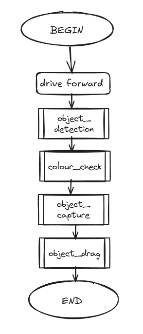
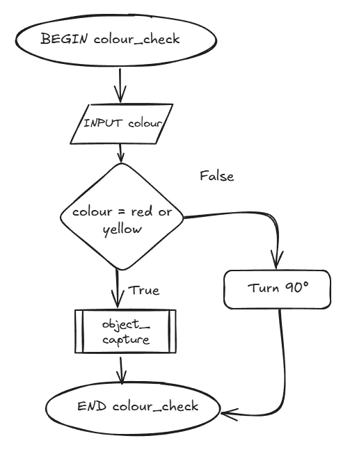
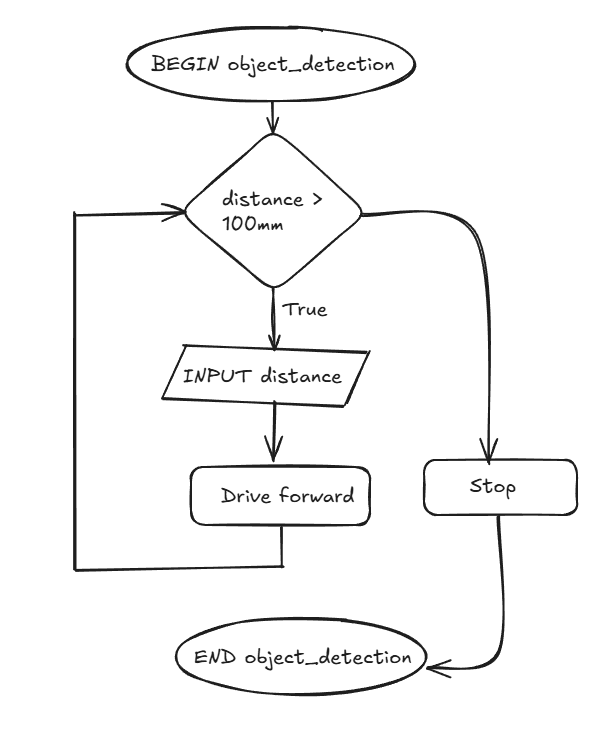

# 9CT Assessment Task
By Emma Cambridge  
# Requirements Outline
I need to create a program for my EV3 robot that allows it to move two blocks to the start zone and dodge two other blocks using two sensors. The program will need to:
- Object Detection: The robot must stop when an object is detected within 10cm
    - Use Case: The robot is navigating and encounters an object. The ultrasonic sensor detects the object within 10cm. The robot stops moving forward. The robot stops 10cm away from the object.
- Check Colour: The robot must use the colour sensor to check whether the object is blue or green, or red or yellow.
    - Use Case: An object is detected in front of the robot. The colour sensor checks whether the colour is blue or green, or red or yellow. The object is detected as red. The robot begins the capturing process.
- Capture the Object: If the colour is detected as yellow or red then the robot must use a skewer attachment to grab the object.
    - Use Case: The colour of an object 10cm in front of the robot is detected as yellow. (No inputs). The robot moves forward to skewer the middle of the object. The object has a skewer through it.
- Drag the Object: After capturing the object the robot must turn 180 degrees and return to the start zone.
    - Use Case: An object in front of the robot has been captured by the skewer attachment. (No inputs). The robot turns 180 degrees and drags the object with it into the start zone. The object and robot are in the start zone area.

## Test Cases
| Test Case | Input     | Expected Output   |
|---------- |---------- |----------------   |
| Detects Obstacle  |  Ultrasonic sensor detects <10cm   |   The robot stops moving forward   |
|  Checks Colour  | Detects colour as blue, green, yellow, or red |  The robot returns the colour and will initiate capture/turn and move away  |
| Captures Object  |  NONE  |  The object has a skewer through it |
| Drags Object | NONE | The object is within the start zone | 

## Non-Functional Requirements
As well as completing the above requirements the robot should react to the ultrasonic sensor's inputs within 2 seconds to prevent it from crashing into an object, complete the task with a moderate level of efficiency (it shouldn't take hours to get the blocks), and accurately skewer the blocks and drag them back to the starting area. 

# Design
~~~
BEGIN
    drive forward
    object_detection
    colour_check
    object_capture
    object_drag 
END
~~~

~~~
BEGIN colour_check
    INPUT colour sensor
    IF colour sensor = red or yellow THEN
        initiate object_capture
    ELSE
        turn 90 degrees
    ENDIF
END
~~~

~~~
BEGIN object_detection
    WHILE distance > 100mm
        INPUT distance
        Drive forward
    ENDWHILE
        Stop
END
~~~

